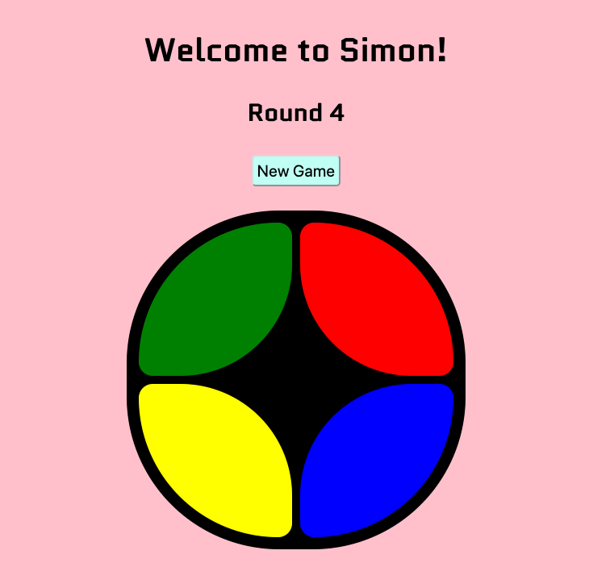

# Front End Game - Simon

## Description
This project is an online version of the memory game Simon. Repeat the pattern of colors shown by Simon correctly for ten rounds, and you win! 



## Approach Taken
My version of Simon uses a simple HTML interface along with CSS to provide a responsive experience for large or small screen viewing. I constructed a game board div with four game button divs within it, each having one of the simon sound effects embedded. 

Once the viewable structure of the game was built, I used JavaScript to perform the various game functions:

- Starting a new game: initializing variables and creating event listeners
- Generating the full game sequence of 10 random colors
- Accepting user input 
- Checking each user input against the game sequence
- Ending the game is the user input is incorrect
- Ending the game if the user successfully completes all 10 rounds

One of the more challenging aspects of the game is comparing the user inputs. I do this continually, with each new input being checked against the game sequence, as opposed to waiting until the user has input the full number of colors needed for the round. 

``` Javascript 
function clickHandler(e) {
    e.preventDefault();

    console.log(e.target.children)

    if (round < 11) 
    {
        playerSequence.push(Number(e.target.dataset.value))

        console.log("player sequence", playerSequence);
        console.log("round", round)

        for(i = 0; i < playerSequence.length; i++) {
            if (playerSequence[i] != gameSequence[i]) {
                document.querySelector('.outcome').innerText = "Wrong, Game Over.";
                turnOffListeners();
                console.log("game over, event listeners off")
                gameOver = true;
            } 
        }

        if (playerSequence.length == round && gameOver == false) { 
            playerSequence = [];
            round++;
            roundStr = "Round " + round;
            document.querySelector('.outcome').innerText = roundStr;
            console.log("round:", round, "player sequence length:", playerSequence.length)
            
            lightUpSequence();
            
        } 
    }
    
```

## List of Technologies
- HTML
- CSS
- JavaScript
- GitHub Pages

## Installation instructions
Since this is a front end game, no software installation is necessary. The game can be played at https://sethchad.github.io/frontend-game/. 

## Unsolved Problems

For future revisions I would like to call the button dim and brighten as well as the sounds effects in a more compact fashion. I use multiple if else statements to check data values on the button divs, but this uses several lines of code and shows up in multiple locations. 
